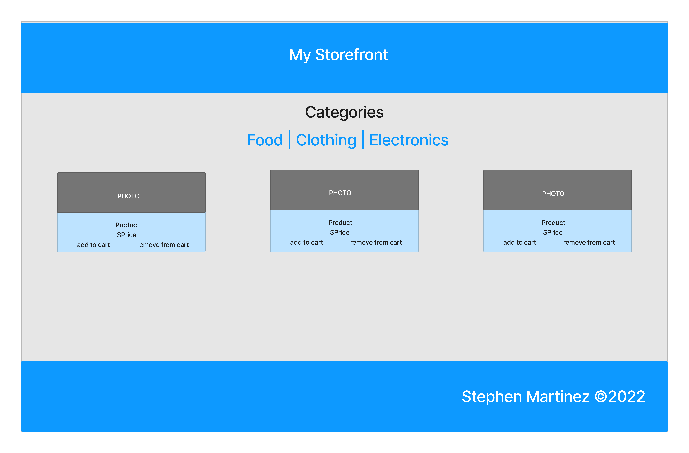

# Lab 36: Application State with Redux

- Virtual Store Phase 1: For this assignment, you will be starting the process of creating an e-Commerce storefront using React with Redux, coupled with your live API server

## Phase 1 Requirements

- Today, we begin the first of a 4-Phase build of the storefront application, written in React. In this first phase, our goal is to setup the basic scaffolding of the application with initial styling and basic behaviors. This initial build sets up the file structure and state management so that we can progressively build this application in a scalable manner

- The following user/developer stories detail the major functionality for this phase of the project.

  - As a user, I expect to see a list of available product categories in the store so that I can easily browse products
  - As a user, I want to choose a category and see a list of all available products matching that category
  - As a user, I want a clean, easy to use user interface so that I can shop the online store with confidence

## Technical Requirements/Notes

- Create a visually appealing site using Material UI
- Use a Redux Store to manage the state of categories and items in the store
- Display a list of categories from state
- When the user selects (clicks on) a category …
  - Identify that category as selected (change of class/display)
  - Show a list of products associated with the category

## Application Architecture

- Create the Virtual Store application as follows:

  - Begin with creating your application using create-react-app
  - Install Material UI as a dependency
  - Write an App component that serves as the container for all sub-components of this application
    - A `<Header>` component which shows the name of your virtual store
    - A `<Footer>` component which shows your copyright and contact information
    - A `<Categories>` component
      - Shows a list of all categories
      - Dispatches an action when one is clicked to “activate” it
    - A `<Products>` component
      - Displays a list of products associated with the selected category

## UML
- 

- [REPO](https://github.com/SdMartinez13/storefront)
- [PR](https://github.com/SdMartinez13/storefront/pull/1)
- [Code Sandbox](https://codesandbox.io/p/github/SdMartinez13/storefront/draft/shy-cookies?file=%2FREADME.md&workspace=%257B%2522activeFileId%2522%253A%2522cla7swtxo000rl0f051aferfz%2522%252C%2522openFiles%2522%253A%255B%2522%252FREADME.md%2522%255D%252C%2522sidebarPanel%2522%253A%2522EXPLORER%2522%252C%2522gitSidebarPanel%2522%253A%2522COMMIT%2522%252C%2522sidekickItems%2522%253A%255B%257B%2522key%2522%253A%2522cla7synlc00f03b6hgk2vouir%2522%252C%2522type%2522%253A%2522PROJECT_SETUP%2522%252C%2522isMinimized%2522%253Afalse%257D%252C%257B%2522type%2522%253A%2522PREVIEW%2522%252C%2522taskId%2522%253A%2522start%2522%252C%2522port%2522%253A3000%252C%2522key%2522%253A%2522cla7sxhmj007g3b6hwcdop3d7%2522%252C%2522isMinimized%2522%253Afalse%257D%252C%257B%2522type%2522%253A%2522TASK_LOG%2522%252C%2522taskId%2522%253A%2522start%2522%252C%2522key%2522%253A%2522cla7sxeob005i3b6hujtibljb%2522%252C%2522isMinimized%2522%253Afalse%257D%255D%257D) Code Sandbox would not let me copy the redux branch so this is the main

## Partners

- [Stephanie Hill](https://github.com/stephnitis)

# Lab 37: Redux-combined Reducers

- Virtual Store Phase 1: For this assignment, you will be starting the process of creating an e-Commerce storefront using React with Redux, coupled with your live API server

## Phase 2 Requirements

- In phase 2, we will be adding the “Add to Cart” feature to our application, which will allow our users to not only browse items in the store, but also select them and have them persist in their “shopping cart” for later purchase.

- The user stories from Phase 1 remain unchanged. For this phase, we are now adding the following new user stories to meet the new requirements.

  - As a user, I want to choose from products in the list and add them to my shopping cart
  - As a user, I want to see the products that I’ve added to my shopping cart so that
  - As a user, I want to change the quantity of items I intend to purchase in my shopping cart
  - As a user, I want to be able to remove an item from my shopping cart
- Application Flow:

  - User sees a list of categories
  - … Chooses a category and sees a list of products
  - … Clicks the “Add to Cart” button on any product
  - … Clicks the “Cart” link in the header
  - … Sees a list of all products in the cart
  - … Clicks the delete button on an item and sees the item removed
  - … Changes the quantity selector on an item and sees the cart total change

## Technical Requirements/Notes

- And as developers, here are the high level development tasks that address the above end user requirements and workflow

  - Continue to use Material UI Components for layout and styling
  - Add a “Cart” indicator to the header, like this: Cart (0)
  - Create a new Cart component to show the items in the user’s cart

## Application Architecture

- Add a new component to the page: `<SimpleCart />`
  - Displays a short list (title only) of products in the cart
  - This should be present at all times
- Home Page Operation:
  - When the user selects (clicks on) a category …
    - Identify that category as selected
    - Show a list of products associated with the category, that have a quantity > 0
    - Add an “add to cart” button to each product
  - When a user clicks the “add to cart” button add the item to their cart
    - In the `<SimpleCart/>` component, show a running list of the items in the cart (just the titles)
    - Change the (0) indicator in the header to show the actual number of items in the cart
    - Reduce the number in stock for that product

## UML
- 

- [REPO](https://github.com/SdMartinez13/storefront)
- [PR](https://github.com/SdMartinez13/storefront/pull/2)
- [Code Sandbox](https://codesandbox.io/p/github/SdMartinez13/storefront/draft/shy-cookies?file=%2FREADME.md&workspace=%257B%2522activeFileId%2522%253A%2522cla7swtxo000rl0f051aferfz%2522%252C%2522openFiles%2522%253A%255B%2522%252FREADME.md%2522%255D%252C%2522sidebarPanel%2522%253A%2522EXPLORER%2522%252C%2522gitSidebarPanel%2522%253A%2522COMMIT%2522%252C%2522sidekickItems%2522%253A%255B%257B%2522key%2522%253A%2522cla7synlc00f03b6hgk2vouir%2522%252C%2522type%2522%253A%2522PROJECT_SETUP%2522%252C%2522isMinimized%2522%253Afalse%257D%252C%257B%2522type%2522%253A%2522PREVIEW%2522%252C%2522taskId%2522%253A%2522start%2522%252C%2522port%2522%253A3000%252C%2522key%2522%253A%2522cla7sxhmj007g3b6hwcdop3d7%2522%252C%2522isMinimized%2522%253Afalse%257D%252C%257B%2522type%2522%253A%2522TASK_LOG%2522%252C%2522taskId%2522%253A%2522start%2522%252C%2522key%2522%253A%2522cla7sxeob005i3b6hujtibljb%2522%252C%2522isMinimized%2522%253Afalse%257D%255D%257D) Code Sandbox would not let me copy the redux branch so this is the main

## Partners

# Lab 38: Asynchronous Actions

- Virtual Store Phase 3: Connect the Virtual Store to an API to retrieve live data from your data source, using thunk to enable asynchronous actions

## Phase 2 Requirements

- In phase 3, we will be connecting our Virtual Store to a live API so that our data is persistent and able to be separately managed.

- The user stories from Phases 1 and 2 remain unchanged. For this phase, we are now adding the following new user stories to meet the new requirements.

  - As a user, I want to interact with live inventory so that I have confidence that the displayed products are in stock
  - As a user, I want to know to that when I add an item to my cart, that it is removed from inventory so that no other users can purchase it

## Technical Requirements/Notes

- And as developers, here are the high level development tasks that address the above end user requirements and workflow

  - Continue to use Material UI Components for layout and styling
  - Load the category and product list from a remote API on page load.
  - Update the product quantity in stock when adding items to (or removing from) the cart
  - Continue to use multiple reducers
- **Notes on State Management**

  - You will need to use `useEffect()` to dispatch a load action on the initial page load
This will need to use `thunk` as it will be asynchronous
  - When adding/removing/updating items in the cart, the action/reducer will need to update the server
    - Perform the appropriate `post`, `put`, or `delete` action via API call (using thunk in an async action) on each of these actions as performed by the users

## UML
- 

- [REPO](https://github.com/SdMartinez13/storefront)
- [PR](https://github.com/SdMartinez13/storefront/pull/2)
- [Code Sandbox](https://codesandbox.io/p/github/SdMartinez13/storefront/draft/shy-cookies?file=%2FREADME.md&workspace=%257B%2522activeFileId%2522%253A%2522cla7swtxo000rl0f051aferfz%2522%252C%2522openFiles%2522%253A%255B%2522%252FREADME.md%2522%255D%252C%2522sidebarPanel%2522%253A%2522EXPLORER%2522%252C%2522gitSidebarPanel%2522%253A%2522COMMIT%2522%252C%2522sidekickItems%2522%253A%255B%257B%2522key%2522%253A%2522cla7synlc00f03b6hgk2vouir%2522%252C%2522type%2522%253A%2522PROJECT_SETUP%2522%252C%2522isMinimized%2522%253Afalse%257D%252C%257B%2522type%2522%253A%2522PREVIEW%2522%252C%2522taskId%2522%253A%2522start%2522%252C%2522port%2522%253A3000%252C%2522key%2522%253A%2522cla7sxhmj007g3b6hwcdop3d7%2522%252C%2522isMinimized%2522%253Afalse%257D%252C%257B%2522type%2522%253A%2522TASK_LOG%2522%252C%2522taskId%2522%253A%2522start%2522%252C%2522key%2522%253A%2522cla7sxeob005i3b6hujtibljb%2522%252C%2522isMinimized%2522%253Afalse%257D%255D%257D) Code Sandbox would not let me copy the redux branch so this is the main

## Partners

- [Luis Rosales](https://github.com/RosalesJr)
- [Stephanie Hill](https://github.com/stephnitis)
- [Tyler Main](https://github.com/TylerofArk)
- [Junyoung Son](https://github.com/Junyoungson808)